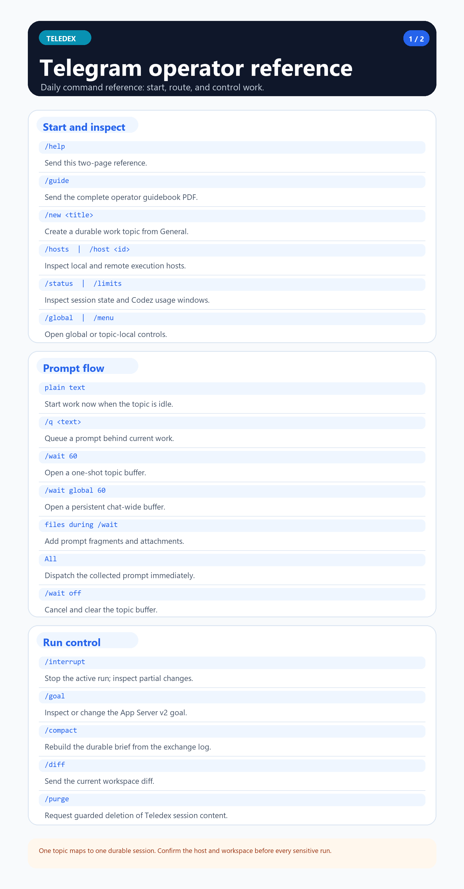
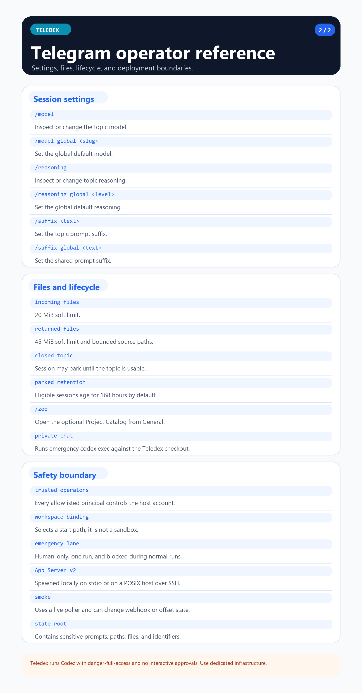
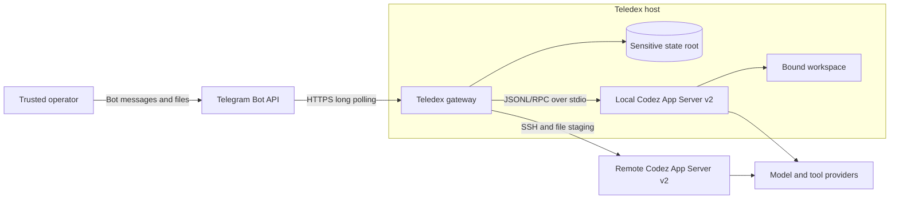

<h1 align="center">Teledex</h1>

<p align="center">
  <strong>Operate durable Codez sessions from Telegram topics.</strong>
</p>

<p align="center">
  <a href="./LICENSE"></a>
  
  
  
</p>

<p align="center">
  <a href="./docs/install-with-codez.md">Install</a>
  &middot;
  <a href="./docs/guidebook-eng.md">Guidebook</a>
  &middot;
  <a href="./docs/architecture.md">Architecture</a>
  &middot;
  <a href="./docs/security.md">Security</a>
  &middot;
  <a href="./docs/index.md">All docs</a>
</p>

Teledex is a self-hosted Telegram gateway for
[Codez](https://github.com/mmmihaeel/codez). It maps a forum topic to a
durable agent session, streams progress back to Telegram, and preserves enough
state to queue, steer, interrupt, resume, and inspect long-running work. Codez
is launched locally over JSONL/RPC on `stdio://`, or on an explicitly
configured remote host over SSH.

Version 0.1.0 exposes one English operator surface across commands, messages,
documentation, and help assets. Stored `ui_language` values are canonicalized
to `eng` when session metadata is read.

> [!WARNING]
> Teledex is a trusted-operator tool, not a sandbox. Agent runs use
> `approvalPolicy=never` and `sandbox=danger-full-access`. An allowlisted
> operator can exercise the filesystem, process, and network authority of the
> account running Teledex. Use a dedicated host or account, a narrow allowlist,
> and workspaces that contain no unrelated sensitive data.

## What it provides

| Capability | Behavior |
| --- | --- |
| Topic sessions | One Telegram forum topic maps to durable Teledex and Codez session state. |
| Prompt control | Start immediately, queue with `/q`, buffer with `/wait`, steer, or interrupt. |
| Runtime controls | Inspect status and limits; select model, reasoning, host, and goal where supported. |
| Artifact delivery | Accept Telegram attachments and return bounded files or workspace diffs. |
| Local and remote execution | Spawn Codez over local stdio or an SSH-backed POSIX remote transport. |
| Emergency repair | Use an isolated private-chat `codex exec` lane to repair the Teledex checkout. |
| Operational continuity | Park unavailable topics, retain eligible sessions, and hand work across service generations. |

## Operator reference

<p align="center">
  <a href="./assets/help/telegram-help-card-eng-1.png"></a>
  <a href="./assets/help/telegram-help-card-eng-2.png"></a>
</p>

Open either card at full resolution, or request the same two-page reference
from General or a work topic with `/help`.

## System context



See [Architecture](./docs/architecture.md) for request, session, remote-host,
and graceful-handover flows.

## Quick start

Source installation and the full verification toolchain require Node.js
`^20.19.0`, `^22.13.0`, or `>=24`, a Codez build with App Server v2 and goal
support, and a Telegram bot in a forum-enabled supergroup.

```sh
git clone https://github.com/mmmihaeel/teledex.git
cd teledex
npm ci
cp examples/teledex.env.example teledex.env
mkdir -p ../teledex-workspace ../teledex-state
$EDITOR teledex.env
npm run doctor -- --env-file teledex.env
npm start -- --env-file teledex.env
```

The only required runtime values are:

```env
TELEGRAM_BOT_TOKEN=replace-me
TELEGRAM_ALLOWED_USER_IDS=replace-me
TELEGRAM_FORUM_CHAT_ID=replace-me
```

`doctor` validates Telegram access, state initialization, and available
systemd metadata. It does **not** launch Codez or prove App Server v2
compatibility. Complete the first run in the foreground and send a disposable
test prompt before installing a service.

On startup, Teledex removes an existing webhook so it can own long polling
without dropping Telegram's pending queue. On the first startup with no saved
offset, it consumes the newest update to establish the offset; send a fresh
message after startup.

Detailed setup: [Install with Codez](./docs/install-with-codez.md) and
[Configuration](./docs/config.md).

## Verification

```sh
npm ci
npm run check:syntax
npm run lint
npm run typecheck
npm test
npm run smoke:config
```

`npm test` excludes live suites. The App Server v2 live suite starts a real
Codez process and can consume model quota:

```sh
npm run test:live:app-server-v2 -- --env-file teledex.env
```

`npm run smoke -- --env-file teledex.env` starts a temporary Telegram poller.
It is Linux-only, refuses to run while the user service is active, may remove a
webhook, and may advance the saved update offset. Use a dedicated bot and chat.

The publication audit expects a clean exported tree and intentionally rejects
`node_modules`. Its checks are useful but are not a substitute for Git history,
release-author, dependency, or visual asset review. See
[Testing and release gates](./docs/testing.md).

## Documentation

- [Documentation index](./docs/index.md)
- [Operator guidebook](./docs/guidebook-eng.md)
- [Deployment](./docs/deployment.md) and [runbook](./docs/runbook.md)
- [Telegram surface](./docs/telegram-surface.md)
- [State contract](./docs/state-contract.md)
- [Security model](./docs/security.md)
- [Compatibility](./docs/compatibility.md) and [stack](./docs/stack.md)
- [Troubleshooting](./docs/troubleshooting.md)

## License

MIT. Teledex is an independent project and is not an official Telegram,
OpenAI, or Codex release.
