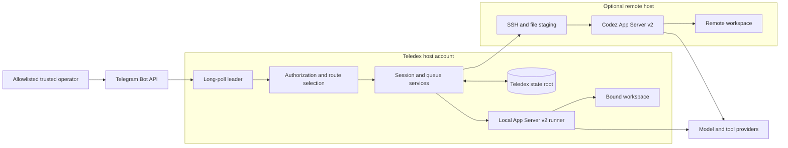
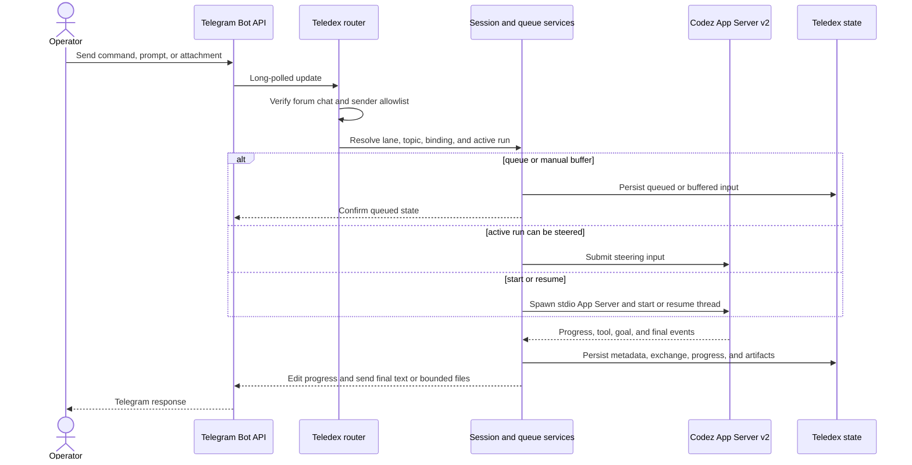
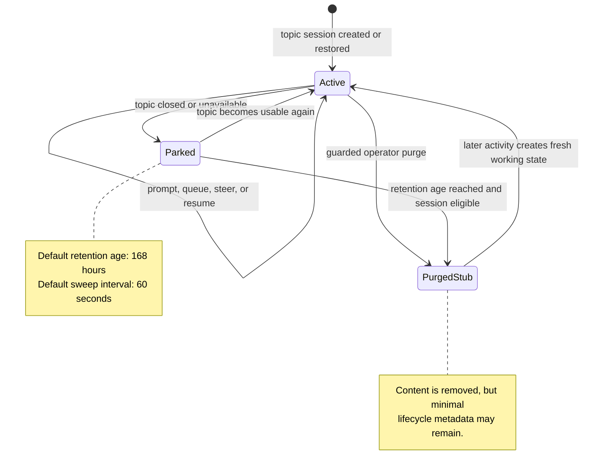
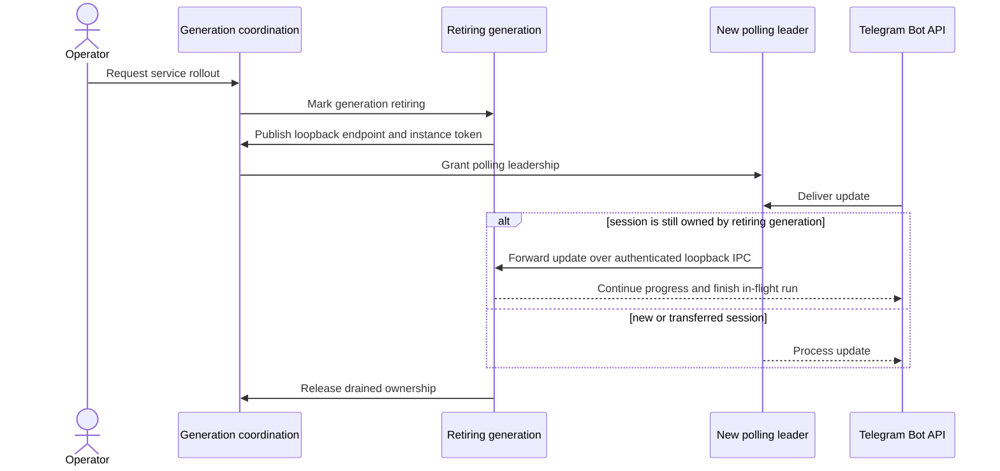

# Architecture

Teledex is a stateful gateway between Telegram and Codez App Server v2. It
owns authorization, chat and topic routing, durable Teledex metadata, prompt
coordination, and Telegram delivery. Codez owns the agent thread and tool
runtime.

## Trust boundaries

Binding resolution rejects paths outside the configured workspace root.
That boundary determines where a session starts and which files Teledex may
stage or deliver; it is not an operating-system sandbox. Codez runs with
`approvalPolicy=never` and `sandbox=danger-full-access`.

## Prompt flow

For a local task, Teledex starts `codex app-server --listen stdio:// --enable
goals` and exchanges JSONL/RPC over child-process stdio. For a remote task,
the host-aware runner stages inputs and launches the same protocol over SSH to
a POSIX-style host.

Private emergency repair is the deliberate exception: an allowlisted human's
private prompt bypasses normal topic/session routing and starts one isolated
`codex exec` process against the Teledex repository root. It is unavailable
while any normal topic run is active. There is no configurable HTTP App Server
transport.

## Session lifecycle

Pinned, busy, compacting, or claimed-queue sessions are not eligible for the
automatic parked-session purge. Teledex retention also does not remove Codez's
separate session store under the configured Codez sessions root.

## Graceful service handover

A Linux service rollout may temporarily have a new polling leader while the
retiring generation still owns in-flight sessions. Generation state and a
token-protected loopback channel preserve routing during the drain.

This design reduces rollout interruption but is not a zero-data-loss
guarantee. Operators still need state backups, health checks, and a rollback
plan.

## Component map

| Area | Responsibility |
| --- | --- |
| `src/cli` | Startup, diagnostics, smoke, service install, rollout, and maintenance entrypoints. |
| `src/telegram` | Bot API, authorization, update routing, commands, panels, attachments, and delivery. |
| `src/session-manager` | Topic metadata, queues, lifecycle, briefs, settings, and ownership. |
| `src/app-server-v2` | JSONL/RPC transport, goals, steering, thread control, and local or remote runners. |
| `src/pty-worker` | Run orchestration, retries, recovery, progress, and artifact staging. |
| `src/hosts` | Host registry, SSH bootstrap, remote execution, and host diagnostics. |
| `src/runtime` | Process, environment, plugin, systemd, generation, and IPC utilities. |
| `src/state` | Directory layout, atomic writes, and platform permission handling. |
| `src/zoo` | Optional Project Catalog topic and project-analysis state. |

App Server v2 is the supported normal topic-session runtime. Private emergency
repair intentionally uses `codex exec`; other legacy execution paths remain in
the source tree for migration and test coverage.
